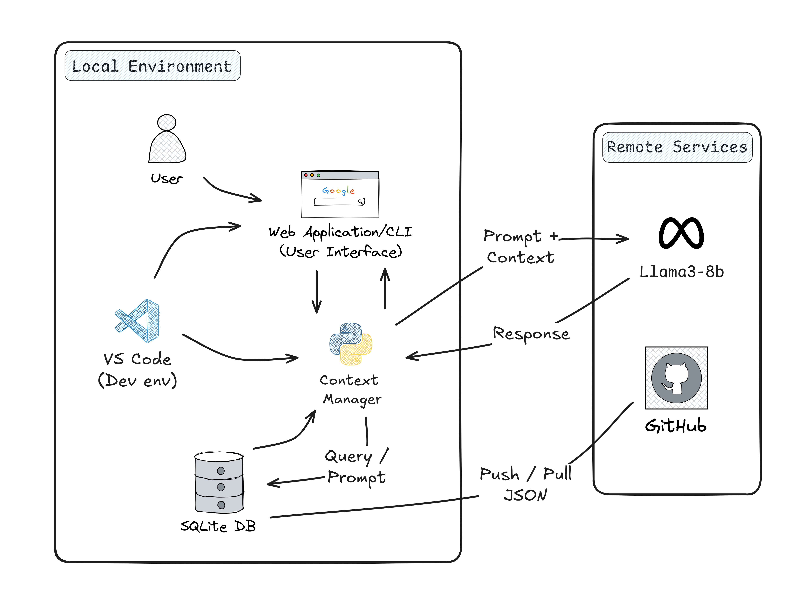

# MCP (Multi-Context Processing) Simulation

## Overview
I've developed this Multi-Context Processing (MCP) system to handle and process multiple contexts efficiently. The project simulates a robust architecture for managing complex data processing tasks with a focus on scalability and maintainability.

## Features
- Multi-context data processing
- Database integration for persistent storage
- Modular architecture for easy extension
- Video demonstration available in the public folder
- Comprehensive architecture documentation


## System Architecture


## Getting Started

### Prerequisites
- Python 3.x
- Virtual environment (recommended)

### Installation
1. Clone the repository
2. Create and activate a virtual environment:
   ```bash
   python -m venv venv
   source venv/bin/activate  # On Windows: venv\Scripts\activate
   ```
3. Install dependencies:
   ```bash
   pip install -r requirements.txt
   ```
4. Initialize the database:
   ```bash
   python setup_db.py
   ```

### Running the Application
```bash
python main.py
```

## Documentation
- Check out the architecture diagram above for a detailed view of the system design
- Watch the  above to see the system in action

## Technical Details
The project implements a sophisticated multi-context processing system that:
- Manages multiple data contexts simultaneously
- Provides efficient data persistence through SQLite
- Implements modular design patterns for maintainability
- Offers clear separation of concerns between data, logic, and presentation layers

## Contributing
Feel free to submit issues and enhancement requests!

